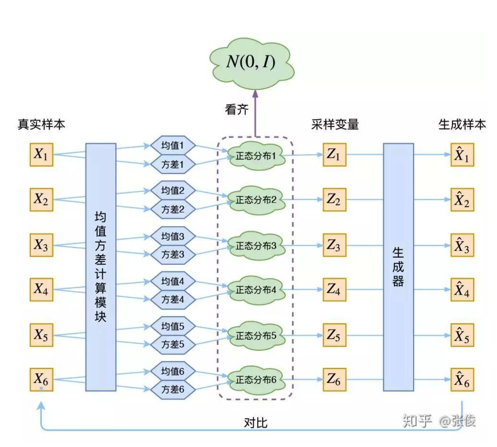

layout: post
title:  BiVAE
date:   2022-02-17 09:00:00
categories: [recommend]
tags: [AI, ML, Recommend]

## Bilateral Variational Autoencoder for Collaborative Filtering

### 输入数据格式

输入数据由user和item的二维数组构成，二维数组的元素代表user和item的交互，交互可以是点击、评分或者是否购买

数据的特点：数据是动态变化的

### 思路

从user角度看，该user对item的交互可以看做是user的feature。

从item角度看，该item被user的交互可以看做是item的feature。

从user角度构建Variational Autoencoder来建模user数据

从item角度构建Variational Autoencoder来建模item数据

user的VAE和item的VAE都旨在构建一个数据的表示，该表示代表该数据的分布。

其中一种形式的交互分计算方法：

$$interactive\_score=user\_represent \cdot item\_represent$$

### Variational Autoencoder

#### 核心思想

VAE的介绍可参见**苏剑林**的这篇文章：https://zhuanlan.zhihu.com/p/34998569

**均值方差计算模块**

均值方差计算模块一般采用MLP即可

**生成器模块**

生成器模块可使用指数族，指数族是一类分布，包括高斯分布、伯努利分布、二项分布、泊松分布、Beta 分布、Dirichlet 分布、Gamma 分布等一系列分布。指数族分布可以写为统一的形式：
$$
p(x|\eta)=h(x)\exp(\eta^T\phi(x)-A(\eta))=\frac{1}{\exp(A(\eta))}h(x)\exp(\eta^T\phi(x))
$$
其中，$\eta$ 是参数向量，$A(\eta)$ 是对数配分函数（归一化因子）。

在这个式子中，$ \phi(x)$ 叫做充分统计量，包含样本集合所有的信息，例如高斯分布中的均值和方差。充分统计量在在线学习中有应用，对于一个数据集，只需要记录样本的充分统计量即可。

**充分统计量和对数配分函数的关系**

对概率密度函数求积分：
$$
\begin{align}
\exp(A(\eta))&=\int h(x)\exp(\eta^T\phi(x))dx\nonumber
\end{align}
$$
两边对参数求导：
$$
\exp(A(\eta))A'(\eta)=\int h(x)\exp(\eta^T\phi(x))\phi(x)dx\\
\Longrightarrow A'(\eta)=\frac{dA(\eta)}{\eta}=\mathbb{E}_{p(x|\eta)}[\phi(x)]
$$
类似的：
$$
A''(\eta)=Var_{p(x|\eta)}[\phi(x)]
$$
由于方差为正，于是 $A(\eta)$ 一定是凸函数。

#### 泊松分布

点击次数可以认为符合泊松分布

泊松分布表达式:
$$
P(X=k)=\frac{\mu^k}{k!}e^{-\mu}=\frac{e^{k\log\mu-\mu}}{k!}
$$
其中$\mu$指均值,$k$指$X$发生次数

泊松分布的指数族形式
$$
p(x|\eta)=h(x)\exp(\eta^Tk-A(\eta))=\frac{1}{\exp(A(\eta))}h(x)\exp(\eta^Tk)
$$
对应泊松分布表达式可以看出

$$
\phi(x)=k, \quad h(x)=\frac{1}{k!}, \quad \eta^T=\log\mu, \quad A(\eta)=e^{\eta}=e^{\log\mu}=\mu
$$

$$
\mathbb{E}_{p(x|\eta)}[\phi(x)]=\mathbb{E}_{p(x|\eta)}(k)=A'(\eta)=e^{\eta}=e^{\log\mu}=\mu
$$

所以我们只要让训练阶段的输出值等于k，最终能学到平均值$\mu$

#### 高斯分布

高斯分布表达式：
$$
P(x|\theta)=\frac{1}{\sqrt{2\pi}\sigma}\exp(-\frac{(x-\mu)^2}{2\sigma^2})
$$
高斯分布指数族形式：
$$
\begin{align}
P(x|\theta)&= \frac{1}{\sqrt{2\pi\sigma^2}}\exp(-\frac{1}{2\sigma^2}(x^2-2\mu x+\mu^2))\\
&=\frac{1}{\sqrt{2\pi}\sigma}\exp(-\frac{1}{2\sigma^2}\begin{pmatrix}-2\mu&1\end{pmatrix}\begin{pmatrix}x\\x^2\end{pmatrix}-\frac{\mu^2}{2\sigma^2})\\
\end{align}
$$
可以看出：
$$
\phi(x)=\begin{pmatrix}x\\x^2\end{pmatrix}\\

\eta=\begin{pmatrix}\frac{\mu}{\sigma^2}\\-\frac{1}{2\sigma^2}\end{pmatrix}=\begin{pmatrix}\eta_1\\\eta_2\end{pmatrix} \\

A(\eta)=\frac{\mu^2}{2\sigma^2}=-\frac{\eta_1^2}{4\eta_2}\\

h(x)=\frac{1}{\sqrt{2\pi}\sigma}
$$

#### MLE：

**指数族分布**
$$
\begin{align}
\log L(\eta) &= \log \prod _{i=1}^{n}p(x_{i}|\eta) \\
&= \log \prod _{i=1}^{n}h(x_{i})\exp(\eta^T\phi(x_{i})-A(\eta))\\
&=\sum _{i=1}^{n}\log(h(x_{i})\exp(\eta^T\phi(x_{i})-A(\eta))) \\
&=\sum _{i=1}^{n}\log h(x_{i})+ \log \exp(\eta^T\phi(x_{i})-A(\eta)) \\
&=\sum _{i=1}^{n}\log h(x_{i})+ \eta^T\phi(x_{i})-A(\eta) \\
\end{align}
$$
**泊松分布**

带入泊松分布参数得
$$
\begin{align}
\log L(\eta) &=\sum _{i=1}^{n}(\log h(x_{i})+ \eta^T\phi(x_{i})-A(\eta)) \\
&= \sum _{i=1}^{n}(\log \frac{1}{k_{i}!}+ k_{i}\log\mu-\mu) \\
\Longrightarrow \mathrm{argmax}_{\eta}(\log L(\eta)) &= \mathrm{argmax}_{\mu}(\log L(\mu)) \\
&= \mathrm{argmax}_{\mu}(\sum _{i=1}^{n}(\log \frac{1}{k_{i}!}+ k_{i}\log \mu-\mu)) \\
&= \mathrm{argmax}_{\mu}(\sum _{i=1}^{n}(k_{i}\log \mu-\mu)) \\
\end{align}
$$
**高斯分布**

带入高斯分布参数得
$$
\begin{align}
\log L(\eta) &=\sum _{i=1}^{n}(\log h(x_{i})+ \eta^T\phi(x_{i})-A(\eta)) \\
&= \sum _{i=1}^{n}(\log\frac{1}{\sqrt{2\pi}\sigma} -\frac{(x_{i}-\mu)^2}{2\sigma^2})\\
\Longrightarrow \mathrm{argmax}_{\eta}(\log L(\eta)) &= \mathrm{argmax}_{\mu}(\log L(\mu)) \\
&= \mathrm{argmax}_{\eta}(\sum _{i=1}^{n}(\log\frac{1}{\sqrt{2\pi}\sigma} -\frac{(x_{i}-\mu)^2}{2\sigma^2}))\\
&= \mathrm{argmax}_{\eta}(\sum _{i=1}^{n}-\frac{(x_{i}-\mu)^2}{2\sigma^2})\\
\end{align}
$$

#### 变分推断

$$
\begin{align}
p(Z|X)&=\frac{p(X,Z)}{p(X)} \\
&=\frac{p(X,Z)}{\int_{z}p(X,Z=z)dz} \\
\end{align}
$$

由于$Z$是一个高维的随机变量，所以$\int_{z}p(X,Z=z)dz$的计算通常会非常困难。

注意此处是计算$p(Z|X)$ 的分布表达式， $Z$的含义是一个概率分布，和MAP的中的表达式不一样，MAP中的$\theta$是参数，是一个值，所以求解时可以将$p(X)$舍弃。

MAP回顾如下：
$$
p(\theta|X)=\frac{p(X|\theta)\cdot p(\theta)}{p(X)}=\frac{p(X|\theta)\cdot p(\theta)}{\int\limits _{\theta}p(X|\theta)\cdot p(\theta)d\theta}\\
\theta_{MAP}=\mathop{argmax}\limits _{\theta}p(\theta|X)=\mathop{argmax}\limits _{\theta}p(X|\theta)\cdot p(\theta)
$$
为了求解$p(Z|X)$

* 引入一个额外的分布$q(Z;\lambda)$，这个分布是我们可以计算的，或者已知表达式的。

* 通过改变参数$\lambda$,使得$q(Z;\lambda)$接近$p(Z|X)$

  

  引入过程如下：

$$
p(X)=\frac{p(X,Z)}{p(Z|X)} \\
\Longrightarrow  \log p(X)=\log p(X,Z)-\log p(Z|X)=\log\frac{p(X,Z)}{q(Z;\lambda)}-\log\frac{p(Z|X)}{q(Z;\lambda)} \\
\Longrightarrow  \mathbb{E}_{q(Z|\lambda)}\log p(X)=\mathbb{E}_{q(Z|\lambda)}\log\frac{p(X,Z)}{q(Z;\lambda)}-\mathbb{E}_{q(Z|\lambda)}\log\frac{p(Z|X)}{q(Z;\lambda)}\\
\begin{align}
\Longrightarrow  \log p(X)&=\mathbb{E}_{q(Z|\lambda)}\log\frac{p(X,Z)}{q(Z;\lambda)}+\mathbb{E}_{q(Z|\lambda)}\log\frac{q(Z;\lambda)}{p(Z|X)} \\
&=\int q(Z;\lambda)\log\frac{p(X,Z)}{q(Z;\lambda)}dZ + \int q(Z;\lambda)\log\frac{q(Z;\lambda)}{p(Z|X)}dZ\\
&=\int q(Z;\lambda)\log\frac{p(X,Z)}{q(Z;\lambda)}dZ + D_{KL}( q(Z;\lambda)\parallel p(Z|X)\\
&={\rm ELBO} + D_{KL}( q(Z;\lambda)\parallel p(Z|X)
\end{align}
$$

将$\lambda$看作变量时，$\log p(X)$的值是常量，所以要使得$q(Z;\lambda)$接近$p(Z|X)$，只需要最大化ELBO。

**分析ELBO：**
$$
ELBO = \int q(Z;\lambda)\log\frac{p(X,Z)}{q(Z;\lambda)}dZ \\
\begin{align}
\Longrightarrow -ELBO &= -\int q(Z;\lambda)\log\frac{p(X|Z)p(Z)}{q(Z;\lambda)}dZ \\
&=-\int q(Z;\lambda)\log p(X|Z)dZ + \int q(Z;\lambda)\log \frac{q(Z;\lambda)}{p(Z)}dZ \\
&=-\int q(Z;\lambda)\log p(X|Z)dZ + D_{KL}( q(Z;\lambda)\parallel p(Z) \\
\end{align}
$$

这两部分$-\int q(Z;\lambda)\log p(X|Z)dZ$是$X$的重构损失，$D_{KL}( q(Z;\lambda)\parallel p(Z)$是$q(Z;\lambda)$和先验$p(Z)$的KL散度。

#### Posterior Collapse in VAE Models

通常的VAE是假设先验$p(Z)\sim\mathcal N(\mathbf{0},\mathbf{I})$ ，，当进行最小化$D_{KL}( q(Z;\lambda)\parallel p(Z)$时，这一各向同性的高斯分布会尽力让各个样本的均值和方差一样，从而使得模型表达能里受限，一个简单的方法是增加额外的输入特征，用来生成不同的输入的不同先验，这样先验就可以和额外特征挂钩，从而一定程度解决后验坍塌的问题。 

#### BIVAE实现的一些细节

* 真实样本在喂入模型之前做了一个操作：Binarize Data，也就是把大于0的数都变为0，等于零的还是0

* 重参数化

~~~
def reparameterize(self, mu, std):
    eps = torch.randn_like(mu)
    return mu + eps * std
~~~

* item和user交替训练，分数是重参数化后的user向量和item向量内积得到的。

