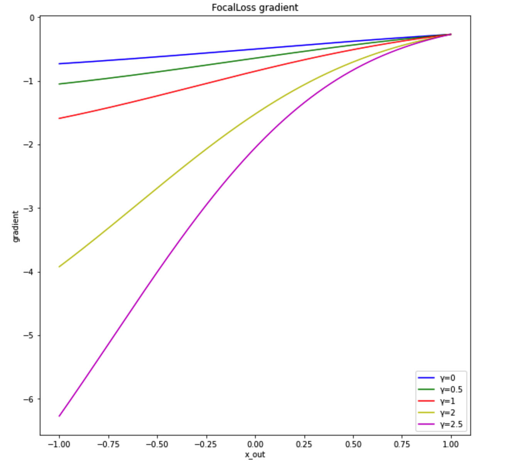

layout: post
title:  FocalLoss
date:   2022-02-25 12:30:00
categories: [loss-function]
tags: [ML,XGboost]

#### 二分类交叉墒

公式：
$$
p_{t} = p*y+(1-p)*(1-y)\\
CE(p_{t}) = -\log(p_{t})
$$

#### FocalLoss

目的：减少易分类样本的梯度，增大难分类样本的梯度

公式：
$$
p_{t} = p*y+(1-p)*(1-y)\\
\alpha_{t} = \alpha*y+(1-\alpha)*(1-y)\\
FL(p_{t}) = -\alpha_{t}(1-p_{t})^{\gamma}\log(p_{t})
$$
其中$\gamma$是调制参数，越小调制作用越小，等于0时退化为交叉墒，$\alpha$用来调整正负样本的学习率。



**相关代码**：

```python
from scipy.misc import derivative
def focal_loss(gamma, alpha=None):
    def custom_loss(y_true, y_pred):
        def FL(y_true, y_pred):
            pt = 1/(1+np.exp(-y_pred))
            pt = (y_true*pt + (1-y_true)*(1-pt))
            if alpha is not None:
                alphat = (y_true*alpha + (1-y_true)*(1-alpha))
                return -alphat*((1-pt)**gamma)*(np.log(pt))
            else:
                return -((1-pt)**gamma)*(np.log(pt))
        partial_FL = lambda y_pred: FL(y_true, y_pred)
        grad = derivative(partial_FL, y_pred, n=1, dx=1e-6)
        hess = derivative(partial_FL, y_pred, n=2, dx=1e-6)
        return grad, hess
    return custom_loss

def ce_loss():
    def custom_loss(y_true, y_pred):
        def ce(y_true, y_pred):
            pt = 1/(1+np.exp(-y_pred))
            pt = (y_true*pt + (1-y_true)*(1-pt)) 
            return -np.log(pt)
        partial_CE = lambda y_pred: ce(y_true, y_pred)
        grad = derivative(partial_CE, y_pred, n=1, dx=1e-6)
        hess = derivative(partial_CE, y_pred, n=2, dx=1e-6)
        return grad, hess
    return custom_loss
```

**绘图代码**

```python
import numpy as np
import matplotlib.pyplot as plt

y_pred = np.arange(-1, 1, 0.001)
y_true = np.ones_like(y_pred)
align_index = -1
y1 = focal_loss(0, None)(y_true, y_pred)[0]
y2 = focal_loss(0.5, None)(y_true, y_pred)[0]
y2 = y2*y1[align_index]/y2[align_index]
y3 = focal_loss(1, None)(y_true, y_pred)[0]
y3 = y3*y1[align_index]/y3[align_index]
y4 = focal_loss(2, None)(y_true, y_pred)[0]
y4 = y4*y1[align_index]/y4[align_index]
y5 = focal_loss(2.5, None)(y_true, y_pred)[0]
y5 = y5*y1[align_index]/y5[align_index]
plt.figure(figsize=(10, 10))
plt.plot(y_pred, y1, 'b', label='γ=0')
plt.plot(y_pred, y2, 'g', label='γ=0.5')
plt.plot(y_pred, y3, 'r', label='γ=1')
plt.plot(y_pred, y4, 'y', label='γ=2')
plt.plot(y_pred, y5, 'm', label='γ=2.5')
plt.ylabel('gradient')
plt.xlabel('x_out')
plt.title('FocalLoss gradient align end')
plt.legend()
```

