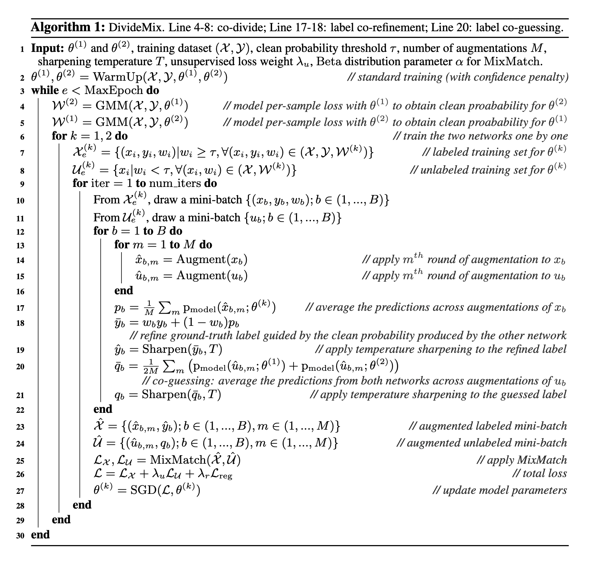

#### 前言
A recent study (Zhang et al., 2017) shows that DNNs can easily overfit to noisy labels and results in poor generalization performance.

Deep networks tend to learn clean samples faster than noisy samples, leading to lower loss for clean samples
左图：
绿：预测正确
蓝：预测错误
右图
绿：预测正确
蓝：既不是正确的label也不是故意标记成的噪声label
红：故意标记的错误label

  

  

  


#### 常见方法
loss correction
通过noise transition matrix修改loss function
通过DNNs的predictions来correct labels and modify the loss accordingly
当噪声比例很大时，上面两个方法会失效，因为噪声数据会主导训练过程并且引起overfitting（MixUp augmentation可以用来解这个问题）

#### 噪声种类
symmetric label noise (i.e. uniformly random)
asymmetric label noise (i.e. class-conditional)

## ELR方法
  

  
为什么有效，求导分析：
  


源代码：
```
class ELRLoss(nn.Module):
    def __init__(self, num_examp, n_classes, lambda_ = 3, beta=0.7, device=None):
        super().__init__()
        self.n_classes = n_classes
        self.target = torch.zeros(num_examp, self.n_classes, device=device)
        self.beta = beta
        self.lambda_ = lambda_

    def forward(self, index, output, label):
        y_pred = F.softmax(output,dim=1)
        y_pred = torch.clamp(y_pred, 1e-4, 1.0-1e-4)
        y_pred_ = y_pred.data.detach()
        self.target[index] = self.beta * self.target[index] + (1-self.beta) * (y_pred_/y_pred_.sum(dim=1,keepdim=True))
        ce_loss = F.cross_entropy(output, label)
        elr_reg = ((1-(self.target[index] * y_pred).sum(dim=1)).log()).mean()
        final_loss = ce_loss +  self.lambda_ *elr_reg
        return final_loss
```

It has been shown that DNNs tend to learn simple patterns first before fitting label noise 

## DivideMix

#### 总体思路
对高概率为非噪声的样本作为有标签的样本，对高概率为噪声的样本作为无标签的样本。这样一个LNL（Learning with Noisy Labels）问题转换为了一个SSL（Semi-supervised Learning）问题。
交替时为了避免确认偏差
  


无监督思想：
enforcing the model to produce low entropy predictions on unlabeled data or consistent predictions on perturbed input。

consistency regularization (i.e. encourage the model to output same predictions on perturbed unlabeled data)
entropy minimization (i.e. encourage the model to output confident predictions on unlabeled data) 
MixUp augmentation (i.e. encourage the model to have linear behaviour between samples)

MixMatch:

  

## DivideMix细节
WarmUp阶段：
对于非对称噪声来说，WarmUp阶段非常容易overfit噪声label，并且产生低墒的预测，为了解决这个问题：增加一部分loss
  

增加后效果：
  

MixUp阶段：
  


对于高噪声比例的数据来说，很容易使得模型输出单一class的值，所以增加一个class分布的先验
  


```
def linear_rampup(current, warm_up, rampup_length=16):
    current = np.clip((current-warm_up) / rampup_length, 0.0, 1.0)
    return args.lambda_u*float(current)

class SemiLoss(object):
    def __call__(self, outputs_x, targets_x, outputs_u, targets_u, epoch, warm_up):
        probs_u = torch.softmax(outputs_u, dim=1)

        Lx = -torch.mean(torch.sum(F.log_softmax(outputs_x, dim=1) * targets_x, dim=1))
        Lu = torch.mean((probs_u - targets_u)**2)

        return Lx, Lu, linear_rampup(epoch,warm_up)

class NegEntropy(object):
    def __call__(self,outputs):
        probs = torch.softmax(outputs, dim=1)
        return torch.mean(torch.sum(probs.log()*probs, dim=1))

def eval_train(model,all_loss):    
    model.eval()
    获取 模型 all_loss
    # fit a two-component GMM to the loss
    gmm = GaussianMixture(n_components=2,max_iter=10,tol=1e-2,reg_covar=5e-4)
    gmm.fit(input_loss)
    prob = gmm.predict_proba(input_loss) 
    prob = prob[:,gmm.means_.argmin()]         
    return prob,all_loss

if epoch<warm_up:       
        warmup_trainloader = loader.run('warmup')
        print('Warmup Net1')
        warmup(epoch,net1,optimizer1,warmup_trainloader)    
        print('\nWarmup Net2')
        warmup(epoch,net2,optimizer2,warmup_trainloader) 
   
    else:         
        prob1,all_loss[0]=eval_train(net1,all_loss[0])   
        prob2,all_loss[1]=eval_train(net2,all_loss[1])          
               
        pred1 = (prob1 > args.p_threshold)      
        pred2 = (prob2 > args.p_threshold)      
        
        print('Train Net1')
        labeled_trainloader, unlabeled_trainloader = loader.run('train',pred2,prob2) # co-divide
        train(epoch,net1,net2,optimizer1,labeled_trainloader, unlabeled_trainloader) # train net1  
        
        print('\nTrain Net2')
        labeled_trainloader, unlabeled_trainloader = loader.run('train',pred1,prob1) # co-divide
        train(epoch,net2,net1,optimizer2,labeled_trainloader, unlabeled_trainloader) # train net2         

    test(epoch,net1,net2)  

def train(epoch,net,net2,optimizer,labeled_trainloader,unlabeled_trainloader):
    net.train()
    net2.eval() #fix one network and train the other
    
    unlabeled_train_iter = iter(unlabeled_trainloader)    
    num_iter = (len(labeled_trainloader.dataset)//args.batch_size)+1
    for batch_idx, (inputs_x, inputs_x2, labels_x, w_x) in enumerate(labeled_trainloader):      
        try:
            inputs_u, inputs_u2 = unlabeled_train_iter.next()
        except:
            unlabeled_train_iter = iter(unlabeled_trainloader)
            inputs_u, inputs_u2 = unlabeled_train_iter.next()                 
        batch_size = inputs_x.size(0)
        
        # Transform label to one-hot
        labels_x = torch.zeros(batch_size, args.num_class).scatter_(1, labels_x.view(-1,1), 1)        
        w_x = w_x.view(-1,1).type(torch.FloatTensor) 
        with torch.no_grad():
            # label co-guessing of unlabeled samples
            outputs_u11 = net(inputs_u)
            outputs_u12 = net(inputs_u2)
            outputs_u21 = net2(inputs_u)
            outputs_u22 = net2(inputs_u2)            
            
            pu = (torch.softmax(outputs_u11, dim=1) + torch.softmax(outputs_u12, dim=1) + torch.softmax(outputs_u21, dim=1) + torch.softmax(outputs_u22, dim=1)) / 4       
            ptu = pu**(1/args.T) # temparature sharpening
            
            targets_u = ptu / ptu.sum(dim=1, keepdim=True) # normalize

            # label refinement of labeled samples
            outputs_x = net(inputs_x)
            outputs_x2 = net(inputs_x2)            
            
            px = (torch.softmax(outputs_x, dim=1) + torch.softmax(outputs_x2, dim=1)) / 2
            px = w_x*labels_x + (1-w_x)*px              
            ptx = px**(1/args.T) # temparature sharpening 
                       
            targets_x = ptx / ptx.sum(dim=1, keepdim=True) # normalize           
            targets_x = targets_x.detach()       
        
        # mixmatch
        l = np.random.beta(args.alpha, args.alpha)        
        l = max(l, 1-l)
                
        all_inputs = torch.cat([inputs_x, inputs_x2, inputs_u, inputs_u2], dim=0)
        all_targets = torch.cat([targets_x, targets_x, targets_u, targets_u], dim=0)

        idx = torch.randperm(all_inputs.size(0))

        input_a, input_b = all_inputs, all_inputs[idx]
        target_a, target_b = all_targets, all_targets[idx]
        
        mixed_input = l * input_a + (1 - l) * input_b        
        mixed_target = l * target_a + (1 - l) * target_b
                
        logits = net(mixed_input)
        logits_x = logits[:batch_size*2]
        logits_u = logits[batch_size*2:]        
           
        Lx, Lu, lamb = criterion(logits_x, mixed_target[:batch_size*2], logits_u, mixed_target[batch_size*2:], epoch+batch_idx/num_iter, warm_up)
        
        # regularization
        prior = torch.ones(args.num_class)/args.num_class
        prior = prior.cuda()        
        pred_mean = torch.softmax(logits, dim=1).mean(0)
        penalty = torch.sum(prior*torch.log(prior/pred_mean))

        loss = Lx + lamb * Lu  + penalty
        # compute gradient and do SGD step
        optimizer.zero_grad()
        loss.backward()
        optimizer.step()
```