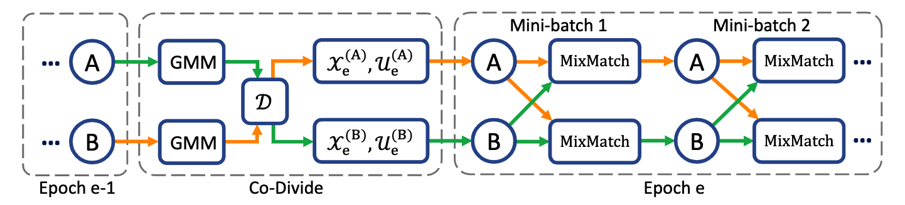
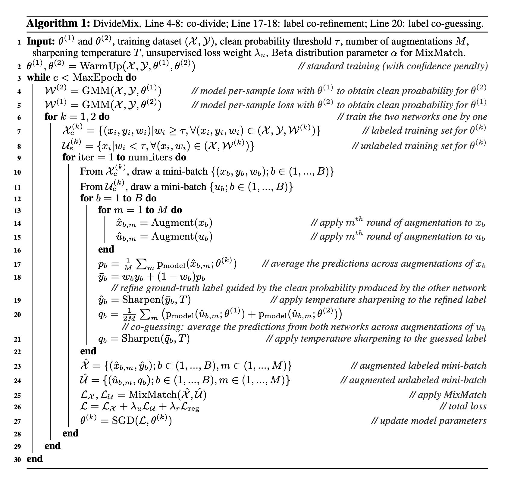

layout: post
title:  Stochastic-Gradient-Langevin-Dynamics
date:   2022-10-12 20:00:00
categories: [loss-function]
tags: [DL,LNL]

#### 前言
A recent study (Zhang et al., 2017) shows that DNNs can easily overfit to noisy labels and results in poor generalization performance.

#### 常见方法
loss correction
通过noise transition matrix修改loss function
通过DNNs的predictions来correct labels and modify the loss accordingly
当噪声比例很大时，上面两个方法会失效，因为噪声数据会主导训练过程并且引起overfitting（MixUp augmentation可以用来解这个问题）

#### 噪声种类
symmetric label noise (i.e. uniformly random)
asymmetric label noise (i.e. class-conditional)

#### 已有的知识
Deep networks tend to learn clean samples faster than noisy samples, leading to lower loss for clean samples

It has been shown that DNNs tend to learn simple patterns first before fitting label noise 

#### 总体思路
对高概率为非噪声的样本作为有标签的样本，对高概率为噪声的样本作为无标签的样本。这样一个LNL（Learning with Noisy Labels）问题转换为了一个SSL（Semi-supervised Learning）问题。
  

MixUp
思想：selects or reweights samples so that noisy samples contribute less to the loss

无监督思想：
enforcing the model to produce low entropy predictions on unlabeled data or consistent predictions on perturbed input。

consistency regularization (i.e. encourage the model to output same predictions on perturbed unlabeled data)
entropy minimization (i.e. encourage the model to output confident predictions on unlabeled data) 
MixUp augmentation (i.e. encourage the model to have linear behaviour between samples)

MixMatch:

  
