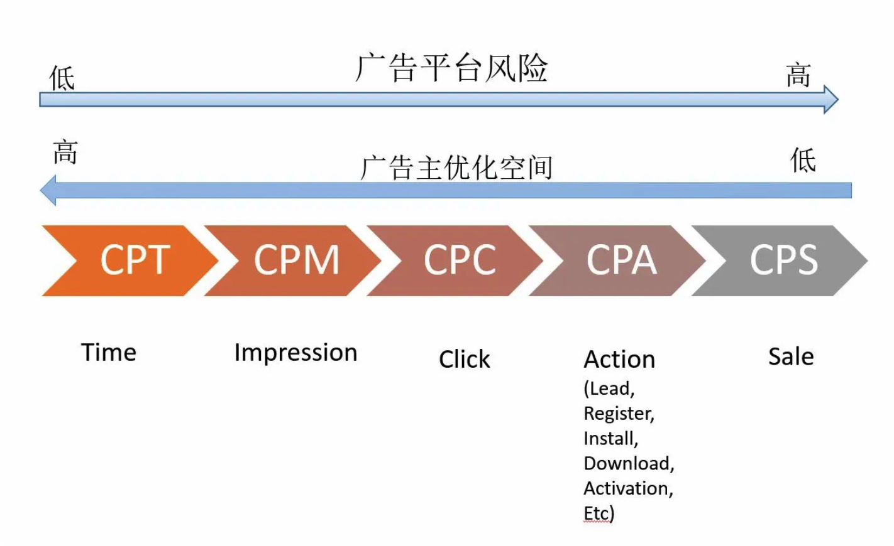

---

layout: post
title:  recommend
date:   2022-11-21 12:00:00
categories: [Recommend]
tags: [recall, pre-rank, rank, re-rank]

---

# 大致漏斗数量级
召回: N -> 千
粗排 千 -> 百
精排 百 -> 个
重排 个 -> 个

召回：召回是漏斗的最上游，决定了推荐系统的上限
## 召回和精排的差异
 

DSP: demand side platform需求方平台
# 广告结算方式
### CPT(cost per time)：
### CPM(cost per mille（impression)）：
### CPA(cost per action)：
### CPS(cost per sale)：
### oCPX(oCPM, oCPC统称)
  

## oCPX

oCPX计费与出价是分离的，即广告主按照后链路的转化（CPA）出价，但是媒体却是按照前链路来收费的（oCPM是曝光，oCPC是点击）。媒体按照前链路收费就必然需要一个前链路的单价，这个单价是广告平台根据广告主的后链路的转化（CPA）出价来估计的（对于oCPM是eCPM，对于oCPC是eCPC）。广告主必须要接受这样一个预估的收费单价，当然有各种技术保证最终折合到后链路的转化（CPA）单价偏差不会太大。

这个方式会一定程度广告主成本的波动，使得广告主暂时减少投放消耗或者停投等行为。

### oCPM(optimized cost per mille（impression))：

oCPM模式下广告主设置目标转化价格（CPA），但是最终媒体端要去对比各个广告主的价格高低，直接对比目标转化价格显然是不合理的，因为不同广告的转化率，点击率都不一样，所以媒体端要通过广告主设置目标转化价格，估计出每次展现的价格.
下式为估计的展示价格：
$$
\text{eCPM}=\text{CPA}(目标转化价格）*\text{eCTR}*\text{eCVR}*\alpha*1000
$$
eCTR：预估点击率，根据同行业类似情况下的历史数据来预估的点击率
eCVR：预估转化率
$\alpha$:调控因子
其中e是预估的意思

**对于媒体来说eCPM代表投放一千次广告能赚多少钱**
**对于广告主来说，代表竞价的值**

### oCPC(optimized cost per click)：
和oCPM类似，不过oCPC是估计每次的点击价格，下式为估计的点击价格：
$$
\text{eCPC}=\text{CPA}(目标转化价格）*\text{eCVR}*\alpha*1000
$$
eCVR：预估转化率
$\alpha$:调控因子
其中e是预估的意思

### 调控因子$\alpha$
调控因子用于调控预估的出价，
1. 在广告竞争不充分的时候，由于采用二阶计费的原因，可能导致广告主的实际转化成本低于预设的目标转化价格，这个时候广告平台为了维护自己的利益，会增大$\alpha$来提高竞价，确保实际的广告主实际转化成本与广告主预设的目标转化价格偏差不大
2. 冷启动时期的归因延迟导致点击率、转化率低，需要调高
3. 点击率、转化率预估的偏差导致广告主实际成本偏差，也需要一个动态的调价因子来进行调整。通常使用到的调整算法是PID调整算法

### oCPX的好处
oCPX的模式从原理上来说是一举三得。
对于媒体来说，对比于之前的固定出价模式，相当于从平均的点击率和转化率的预估转为个性化的点击率和转化率的预估，有利于平台利益的最大化。
对于广告主来只需要设定目标成本，出价的方式更加智能，有利于找到自己的潜在需求客户，减少无效曝光。
对于用户来说，看到的广告都是自己感兴趣的，用户体验更好。
对于优质流量媒体来说oCPM和oCPC的模式差别不大

## 对于oCPX的计费模式，广告主优化自己的人群筛选模型（RTA投放，人群包）的意义
首先解释下RTA：广告主实时回答那些流量是否参与竞价，可设置溢价系数（相对于预先设置的价格）
理论上来说，oCPX计费模式下，广告平台一直在给合适的人找合适的广告，只要广告平台做的足够好，广告主再去做优化自己的人群筛选模型似乎意义不大。
所以我在想到底意义在哪呢？
两方都在做转化率预估的事情，博弈。
广告平台模型做的不够细，广告主补充模型来提升自己的转化量。
那么能不能省钱呢。假设广告主虚报转化率，保持出价不变，那么广告系统应该能发现点击率的变化。假设广告主报真实转化率（提升了），价格

## 广告常识
广告投放初期会将你放到一个很小的流量池，在这个池子里，你的表现好，会把你放到更大的流量池 ，同样表现好的话，就会继续放大流量，如果被同个池子的其他广告PK掉了，一般就没量了。ECPM就是衡量你是否让你进入下一层流量池的值

https://zhuanlan.zhihu.com/p/104228310
申探社：深入互联网广告中的出价模式（上）— 基础出价模式
https://zhuanlan.zhihu.com/p/87606755
申探社：深入互联网广告中的出价模式（中） — 智能出价模式
https://zhuanlan.zhihu.com/p/88522899
申探社：深入互联网广告中的出价模式（下） — 联盟，RTB和RTA
https://zhuanlan.zhihu.com/p/139635658