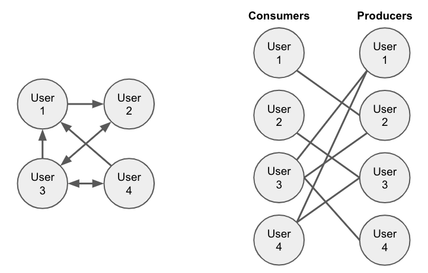
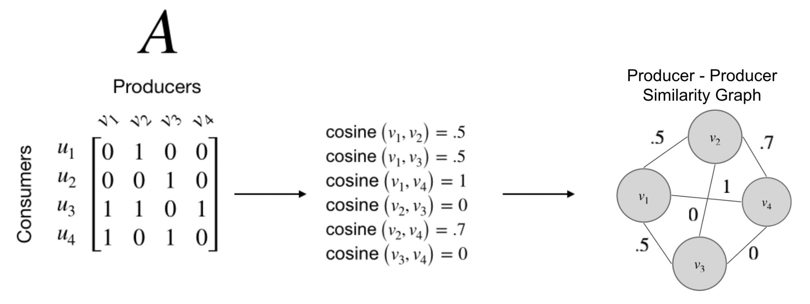
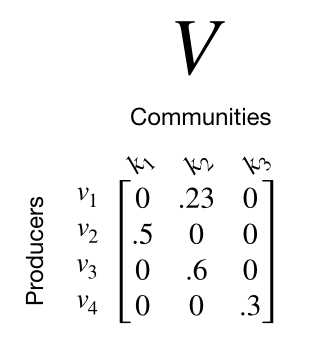
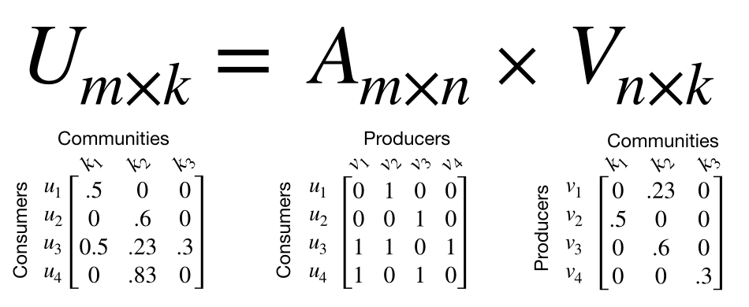
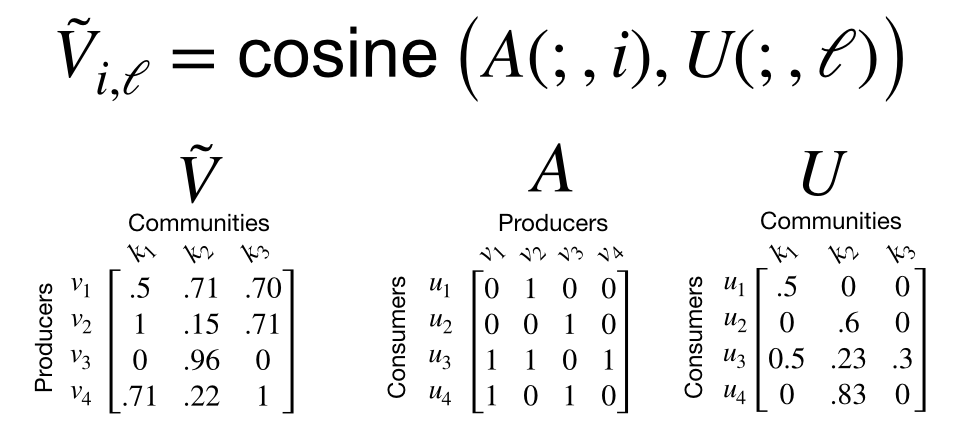

---

layout: post
title:  SimClusters
date:   2023-05-16 19:00:00
categories: [Recommend]
tags: [open, twitter, recommend]

---

## 关注图

## 关注矩阵

### noisy removal
在构成的相似度图中，有的点之间的相似性很小，这个时候这条边就没有必要，所以实际中会把这些小于一定阈值的边删除。

### 社区发现
利用 Metropolis-Hastings sampling-based community detection算法，可以在noisy removal后的相似图中做社区发现

## Known For Matrix

nxk的Known For矩阵大部分是稀疏的，每个producer最多关联一个社区
实际数据中参数 n=20M producers, k ~= 145000. 

## Consumer Embeddings - User InterestedIn
利用关注矩阵和Known For矩阵做乘法就得到Consumer Embeddings

## Producer Embeddings - User InterestedIn
由于Known For矩阵限制了一个producer只能关联一个社区，但实际上每个producer可能产生的话题是多种多样的，只不过某个话题比较突出，Known For矩阵适合计算，但并不适合表征producer。可以利用关注矩阵和InterestedIn矩阵计算相似度就得到Producer Embeddings

## Entity Embeddings

### Tweet embeddings
人与推文的交互可以得到一个交互矩阵，有了这个矩阵可以做推文之间的相似性

### Topic embeddings
对于有话题的推文，可以统计用户在这个话题下喜欢的次数，构建用户-话题矩阵T，然后利用InterestedIn矩阵和T矩阵计算相似度就得到Topic embeddings